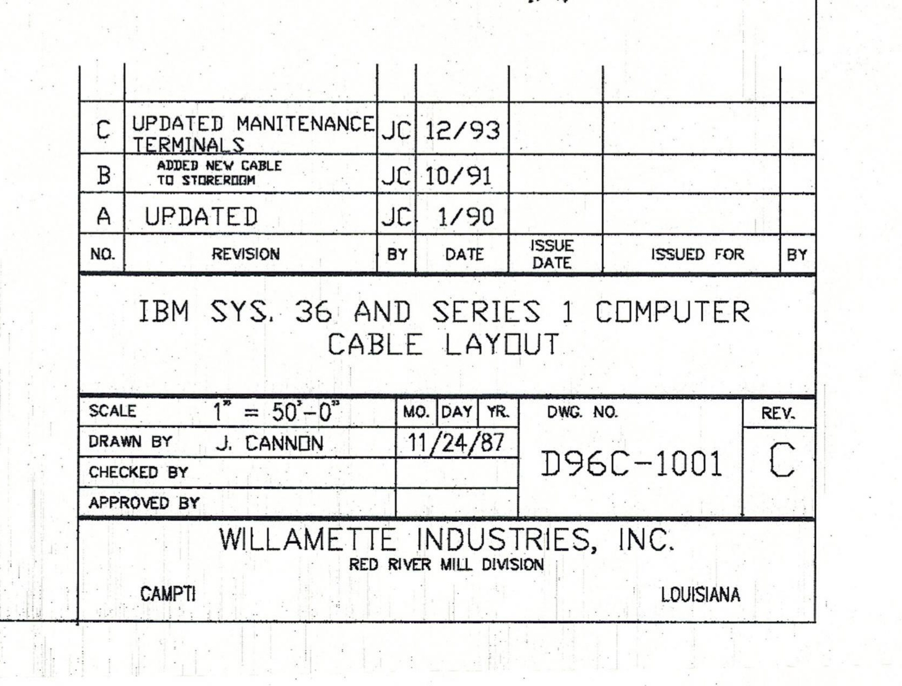
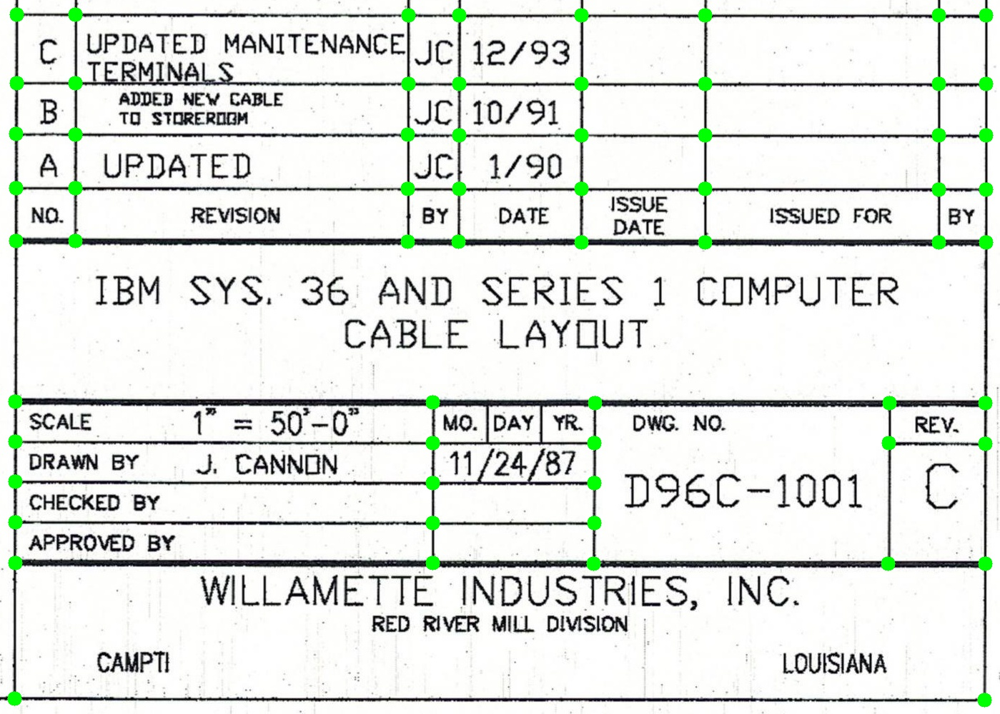
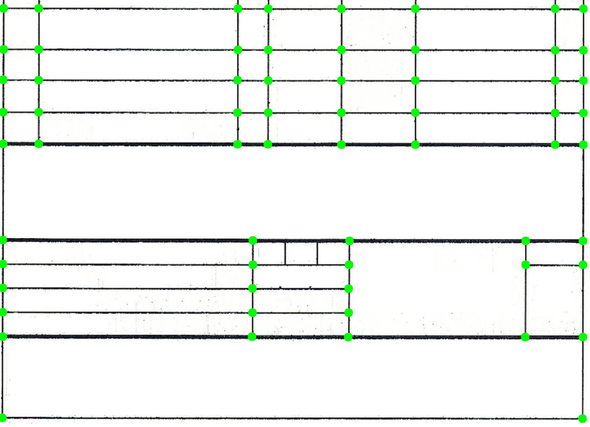
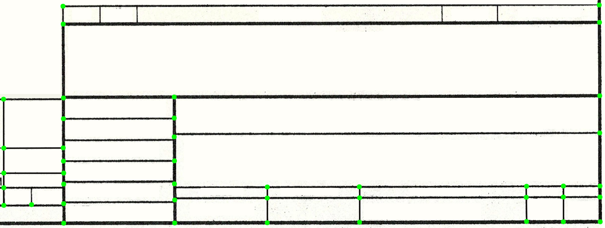
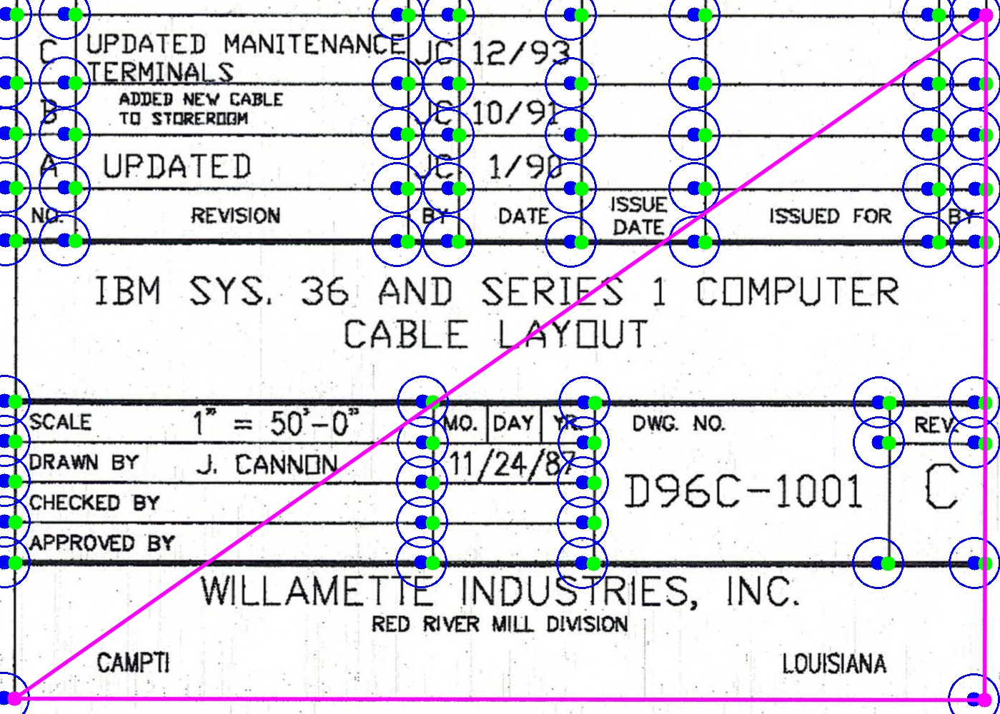
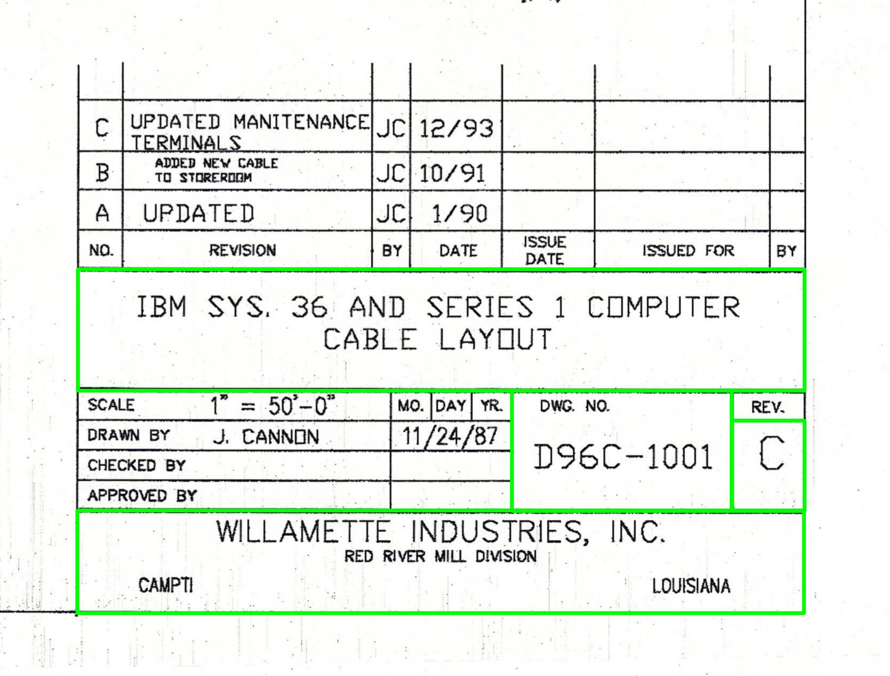

# **Table pattern matcher**

---

### This module allows you to determine to which template the input image of the table belongs. Also, on templates, you can select regions that contain certain values (title, company, etc.). If a match is found between the picture and the template, the coordinates of the regions will be recalculated and displayed in the original picture.

---

## How it works?

### Step 1: The module grab source image from "tables" directory

### Step 2: Key points (intersections of table lines) are determined in the picture. The image is cropped and straightened as needed

### Step 3: Table key points are compared to key points for each template:

|         Table key points          | Key points of the right template  | Key points of an inappropriate template |
| :-------------------------------: | :-------------------------------: | :-------------------------------------: |
|  |  |        |

### Step 4: The points of the table are matched with the points of the template, and an affine transformation (using key points on purple triangle) is calculated, which will be used for further recalculation of coordinates.

 

### 

### Step 5: The coordinates of the regions on the template are recalculated by the affine transformation into the coordinates of the original table

